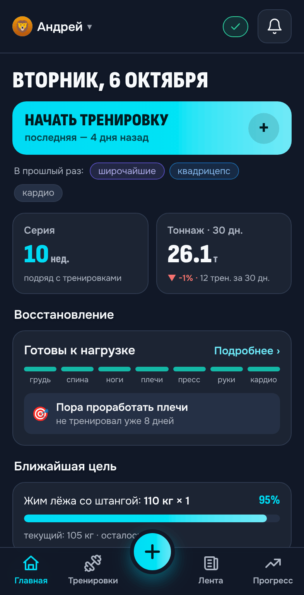
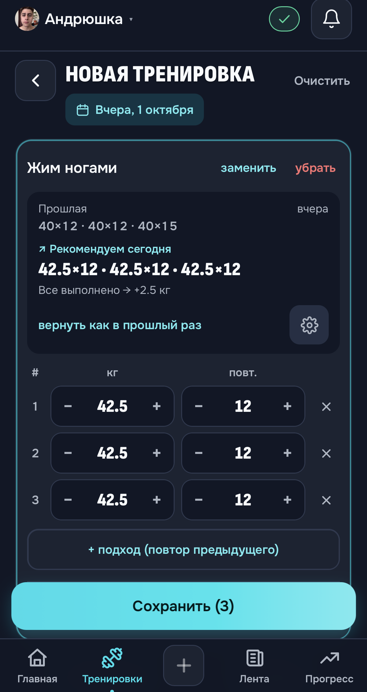
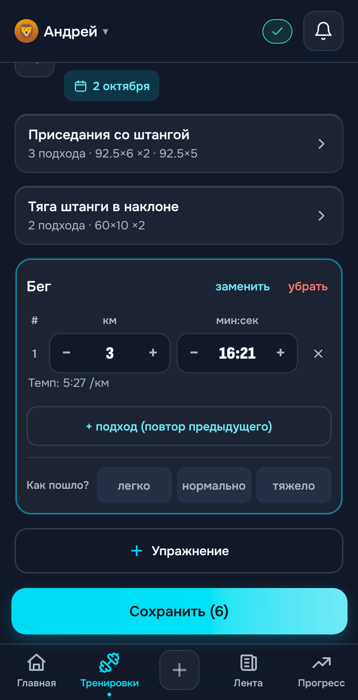
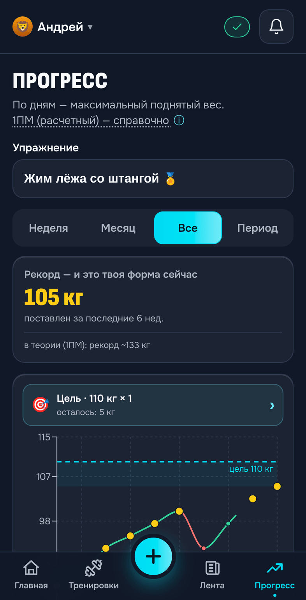
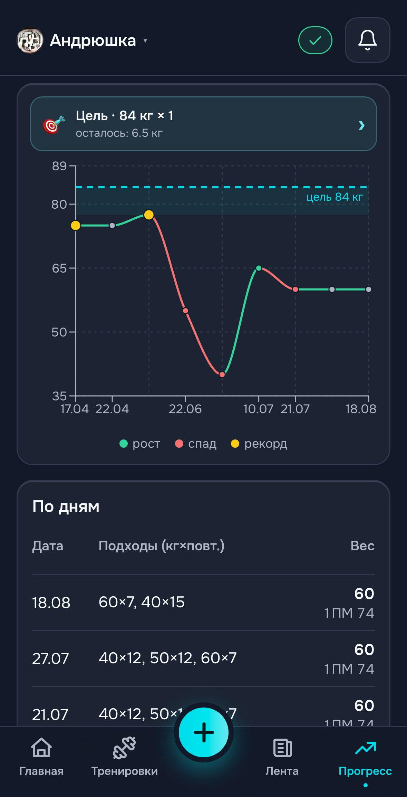
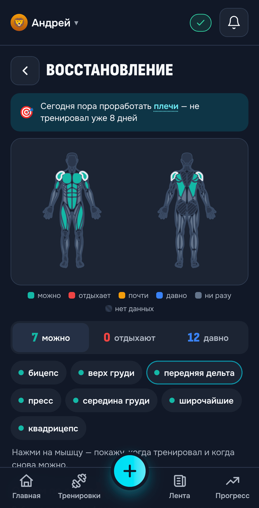
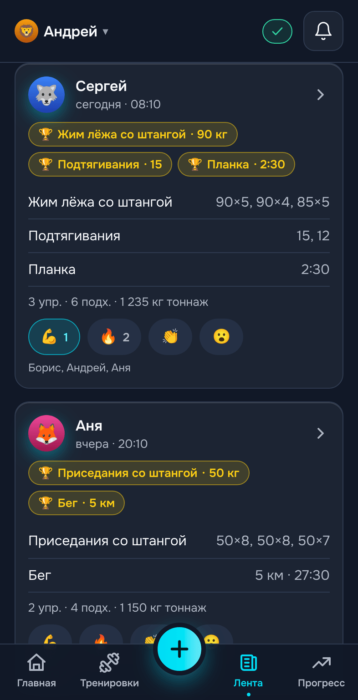
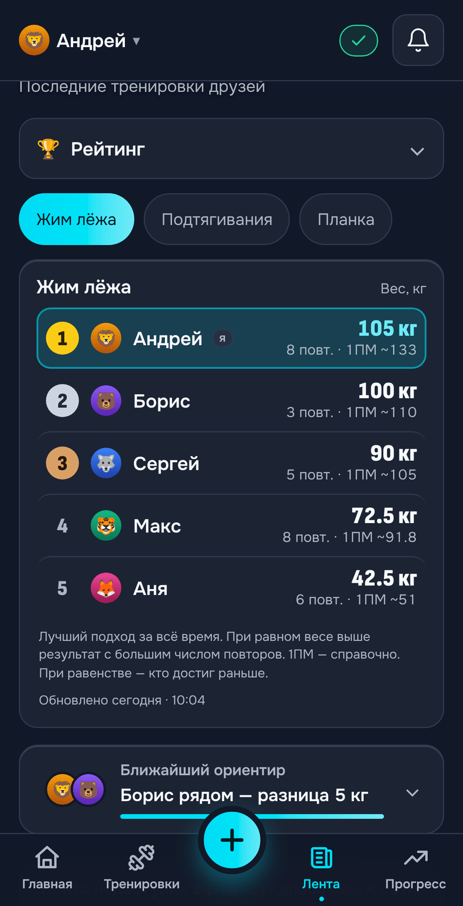
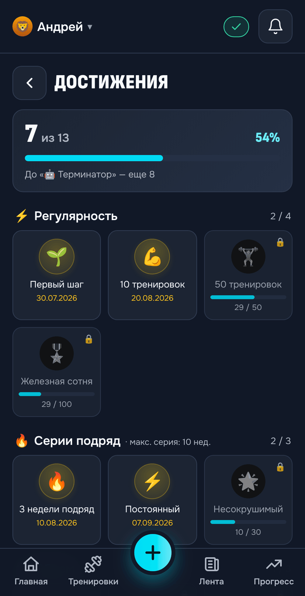
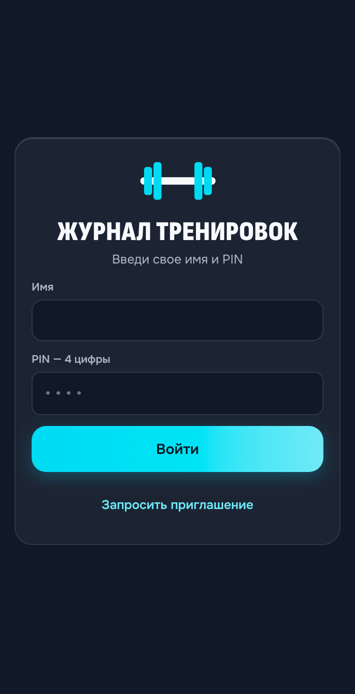

# 💪 kachalka-app

**kachalka-app** — приложение для ведения силовых тренировок, отслеживания прогресса и тренировок вместе с друзьями.

Записывай подходы прямо в зале, следи за рабочими весами и личными рекордами, ставь цели и смотри, какие группы мышц давно не получали нагрузку.

🌐 **Приложение:** https://myr4ge15.github.io/kachalka-app/  
📖 **[Быстрый старт](docs/quick-start.md)**

> **Доступ по приглашению.** Регистрация в kachalka-app доступна по приглашению существующего участника. Учётную запись также может создать администратор.

  

## Что умеет

- 🏋️ **Тренировки** — упражнения, подходы, вес, повторения и время; бег, ходьба, эллипс и велотренажер — в километрах и минутах, с темпом. История, календарь и редактирование записей.
- 📋 **Шаблоны** — готовые тренировки без повторного набора упражнений и подходов.
- 🔎 **Упражнения** — поиск и фильтрация по группам мышц, недавние и часто используемые упражнения, возможность создавать свои.
- 💡 **Рекомендации** — следующая нагрузка рассчитывается с учётом результатов предыдущих тренировок.
- 📈 **Прогресс** — графики результатов, история по дням и динамика рабочих весов.
- 🏅 **Личные рекорды** — лучшие результаты в упражнениях и расчётный максимум на одно повторение.
- 🎯 **Цели** — конкретные результаты в упражнениях и прогресс к ним.
- 💪 **Восстановление** — карта мышечных групп на основе истории тренировок и подсказки, чему давно не уделялось внимания.
- 📊 **Статистика** — тренировочный ритм и объём нагрузки по группам мышц.
- 🏆 **Достижения** — награды за тренировки и серии занятий.
- 👥 **Социальные функции** — лента тренировок друзей, реакции и новые рекорды.
- 🥇 **Рейтинг** — сравнение результатов участников по весу, повторениям или времени.
- 🔔 **Уведомления** — реакции на тренировки, побитые рекорды и ответы разработчика приходят пушем.
- 📱 **Offline-first** — запись тренировок без интернета с последующей синхронизацией.

## Тренировки

Во время тренировки всё нужное находится в одном месте: предыдущие результаты, текущие подходы и рекомендуемая нагрузка.

  

Вес и количество повторений можно менять прямо во время занятия. После сохранения результаты попадают в историю и учитываются при следующих тренировках.

Если предыдущая нагрузка выполнена успешно, kachalka-app может предложить следующий вес и количество повторений.

Тренировку можно собрать вручную или использовать заранее подготовленный шаблон. При выборе упражнения доступны поиск, фильтры по группам мышц, недавние и часто используемые упражнения, а также собственные упражнения.

Бег, ходьба, эллипс и велотренажёр записываются в километрах и минутах — темп на километр приложение считает само.

  

## Прогресс

Для каждого упражнения хранится история результатов: рабочие веса, подходы, личные рекорды и динамика по тренировкам.

  
  &nbsp;&nbsp;
  

Можно поставить конкретную цель и видеть, насколько текущий результат приблизился к ней.

График позволяет посмотреть изменение результатов со временем, а история по дням — вернуться к конкретным тренировкам и подходам.

Для оценки силового прогресса kachalka-app также показывает расчётный 1ПМ — ориентировочный максимум на одно повторение.

## Восстановление

Карта тела показывает состояние мышечных групп на основе истории тренировок.

  

Она помогает быстро увидеть, какие мышцы недавно тренировались, какие уже можно нагружать, а какие давно не получали нагрузки.

kachalka-app также подсказывает, каким группам мышц давно не уделялось внимания, и показывает тренировочный объём по группам за последние недели.

> Оценка восстановления является ориентировочной и строится на истории тренировок.

## Вместе с друзьями

kachalka-app можно использовать не только как личный дневник — приложение рассчитано и на тренировки своим кругом.

  

В ленте отображаются тренировки участников, их результаты и новые рекорды. На тренировки можно оставлять реакции.

В рейтинге можно сравнивать результаты по отдельным упражнениям — по максимальному весу, количеству повторений или времени.

  

## Достижения и цели

Цель ставится для конкретного упражнения — например, выйти на определённый вес и количество повторений. Прогресс к ней виден на Главной и в «Прогрессе».

Достижения отмечают тренировочные результаты, регулярность и серии занятий: у полученных — дата, у остальных — сколько осталось.

  

## Данные и работа без интернета

После первого входа данные сохраняются на устройстве, поэтому тренировку можно записывать даже без сети. Когда подключение появляется снова, изменения синхронизируются.

Каждый участник управляет своими тренировками самостоятельно. Чужие записи доступны только для просмотра.

Для приватных участников предусмотрен отдельный режим видимости с доступом для выбранных людей. Приватные участники не отображаются в общем рейтинге.

Свои данные можно экспортировать и импортировать через **Профиль → Настройки**.

Нашли ошибку или есть идея — **Профиль → «Написать разработчику»**. К сообщению можно приложить скриншот, а версия приложения и модель телефона добавятся сами. Ответ разработчика приходит уведомлением и виден там же, в «Моих обращениях» — иногда со скриншотами, как что-то настроить. Если не помогло, обращение можно открыть снова и написать, что не так.

## Доступ и установка

kachalka-app работает как закрытый клуб. Само приложение доступно в браузере, но для входа нужна учётная запись.

Новый участник может присоединиться по одноразовому приглашению от существующего пользователя. Учётную запись также может создать администратор. Кто нашёл ссылку на приложение сам, может нажать «Запросить приглашение» и оставить пару слов о себе — владелец решит, и приглашение откроется на том же устройстве.

  

После первого входа kachalka-app можно добавить на главный экран телефона. Это PWA, поэтому приложение запускается практически как обычное мобильное приложение и не требует установки из магазина.

## Сторонние материалы

- Карта тела: SVG-пути адаптированы из [react-native-body-highlighter](https://github.com/HichamELBSI/react-native-body-highlighter), MIT, © 2022 ELABBASSI Hicham.
- Шрифты: [Onest](https://github.com/RTDeluxe/onest) и [Sofia Sans Condensed](https://github.com/lettersoup/Sofia-Sans), SIL Open Font License 1.1.

---

**kachalka-app · v6.15.4**
